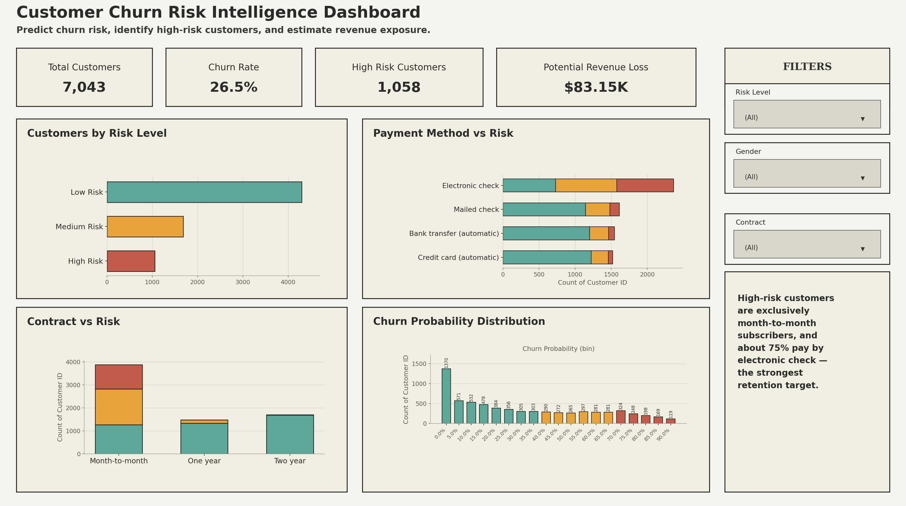

# Customer Survival Analysis & Churn Prediction (Telco Customers)

## 📌 Project Summary
This project analyzes **customer churn** in a single merged notebook (`Customer_Churn_Analysis_Merged.ipynb`) that combines:
1) **Exploratory Data Analysis (EDA)** to understand churn patterns
2) **Survival Analysis** to study *when* customers churn (time-to-event)
3) **Machine Learning** to predict *whether* a customer will churn, benchmarked across five models
4) **Business Application** to translate predictions into a risk tier and a retention action
5) **Export** of the final scored population for use in Tableau / BI dashboards

Dataset: **Telco Customer Churn (`Telco_Cusomer_Churn.csv`)**

## 🎯 Business Goal
- Identify customers likely to churn and the main drivers behind churn
- Understand churn risk over time (customer lifetime / tenure-based churn behavior)
- Support retention strategy decisions using interpretable model results and a rule-based retention action per customer

## 🗂 Dataset Overview
The dataset contains customer demographics, services, contract details, and billing data.

**Target column**
- `Churn` → **0 = No**, **1 = Yes**

**Key features**
- **Customer profile:** `gender`, `SeniorCitizen`, `Partner`, `Dependents`
- **Services:** `PhoneService`, `MultipleLines`, `InternetService`, `OnlineSecurity`, `TechSupport`, `StreamingTV`, etc.
- **Billing & contract:** `Contract`, `PaymentMethod`, `PaperlessBilling`
- **Charges:** `MonthlyCharges`, `TotalCharges`
- **Time feature:** `tenure` (used for survival analysis)

## ⚙️ Data Preprocessing (Common Steps)
- Dropped `customerID` for modeling (re-attached at export time for reporting)
- Cleaned `TotalCharges` (converted to numeric, filled blanks with 0)
- Encoded binary columns (Yes/No → 1/0)
- One-hot encoded categorical columns:
  - `InternetService`
  - `Contract`
  - `PaymentMethod`

All of the above is handled by a single reusable `datapreparation()` function defined in the EDA section and reused unchanged in the Survival Analysis and Prediction Modeling sections.

## 📁 Notebook Sections (What the merged notebook contains)

### 1) Exploratory Data Analysis
- Checked missing values, datatypes, and class imbalance
- Visualized churn across customer segments using countplots and distributions
- Compared churn trends across:
  - contract types
  - internet service types
  - payment methods
  - tenure and monthly/total charges

**Key insights**
- Customers with **shorter tenure** show higher churn risk
- **Month-to-month contracts** are strongly associated with churn
- Customers with **fiber optic internet** show a higher churn trend vs. other services
- Billing features like **MonthlyCharges / TotalCharges** strongly affect churn behavior

### 2) Customer Survival Analysis (Time-to-Churn Modeling)
- Used **tenure as time duration**
- Kaplan-Meier survival curves with log-rank tests, compared across every categorical feature (gender, senior citizen, partner, dependents, phone/internet service, contract, payment method, paperless billing, etc.)
- **Cox Proportional Hazards** regression for survival regression
- Customer Lifetime Value (LTV) estimate derived from the survival function

**Key insights**
- Survival probability drops sharply early on — churn happens more in the first months of tenure
- Contract type and service type affect churn timing
- Survival analysis explains **when** churn happens, not just whether it happens

### 3) Churn Prediction Modeling
**Random Forest — tuned via 4 rounds of `GridSearchCV`**
- Grid 1: `max_features`, `n_estimators`
- Grid 2: `max_depth`, split criteria, `bootstrap`
- Grid 3: `min_samples_split`, `min_samples_leaf`
- Grid 4: `class_weight`

**Model comparison — five models benchmarked side by side on the same train/test split:**
- Random Forest (tuned)
- Logistic Regression (baseline)
- XGBoost (tuned via `RandomizedSearchCV`)
- XGBoost (fixed-weight, untuned)
- LightGBM (class-balanced)

Each model is scored with **ROC-AUC, PR-AUC (average precision), and precision/recall/F1 on the churn=1 class at its own best threshold** (rather than the default 0.50 cutoff), since churn is an imbalanced classification problem where accuracy alone is misleading.

**Explainability**
- **Feature Importance** — from the Random Forest (via `churn_prediction`) and from LightGBM
- **Permutation Importance** — via `eli5`
- **SHAP**
  - *Local:* a single-customer force plot explaining one prediction
  - *Global:* summary/beeswarm plots across the whole test set showing overall feature impact and direction
- **Gauge chart** — a simple visual for communicating one customer's churn probability

### 4) Business Application — Risk Segmentation & Retention Actions
- Scores the full customer population with the selected model
- Buckets each customer into **High / Medium / Low risk** based on predicted churn probability
- Applies a rule-based **retention action** to each high-risk customer (e.g. "Offer contract discount," "Promote auto-pay switch," "Upsell support bundle") based on their contract, payment method, tenure, and service profile

### 5) Export for Tableau / BI
- Scores every customer in the dataset (not just the test split)
- Exports a single CSV (`results/churn_predictions_for_tableau.csv`) containing the original customer attributes plus predicted churn, churn probability, risk tier, and retention action — ready to load directly into a Tableau dashboard

## 🛠 Tools & Libraries Used
- Python
- Pandas, NumPy
- Matplotlib, Seaborn
- scikit-learn
- XGBoost, LightGBM
- lifelines (Survival Analysis)
- SHAP
- eli5 (Permutation Importance)

## 🧠 Assumptions
- Missing `TotalCharges` (new customers, tenure = 0) are filled with 0 rather than dropped
- "No internet service" / "No phone service" are treated the same as "No" during encoding
- Final Random Forest hyperparameters are hardcoded from the grid search, not auto-refreshed if data changes
- Classification threshold is tuned for F1 / a fixed recall target, not a business-defined cost of false negatives vs. false positives
- Risk tiers (High >0.7, Medium >0.4, Low otherwise) and retention-action rules are fixed thresholds, not derived from a cost-benefit analysis or A/B test
- The Random Forest is used as the default production model in Sections 4–5, regardless of which model wins the Section 3.4 comparison on a given run

## 🚀 Future Improvements
- Wire the winning model from the comparison table automatically into Sections 4–5, instead of always defaulting to Random Forest
- Add cross-validation to the final model comparison, not just a single train/test split
- Replace the static retention-action rules with a tested or learned policy (e.g. validate against actual retention lift)
- Add PDP (partial dependence plots) for top features — referenced as a goal earlier but not yet implemented
- Add a monitoring/retraining plan for when the model is deployed

## ✅ Final Conclusion
This project delivers a complete churn analytics pipeline in one notebook:
- EDA explains **what patterns drive churn**
- Survival analysis explains **when churn happens**
- The model comparison identifies **who is likely to churn**, benchmarked across five algorithms with imbalance-aware metrics (ROC-AUC, PR-AUC, churn-class F1/recall at a tuned threshold)
- The business layer turns predictions into **risk tiers and concrete retention actions**, exported for use in a BI dashboard

Exact metric values (ROC-AUC, PR-AUC, precision/recall/F1 per model) are produced by running the notebook's Section 3.4 comparison table — they aren't hardcoded here since they depend on the run environment and library versions.

## 📊 Dashboard Preview
